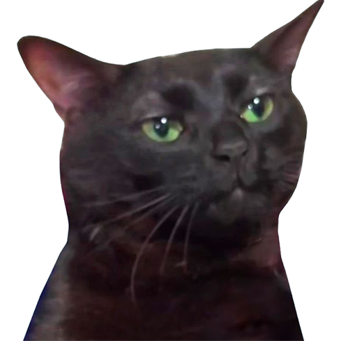

# Cat Kingdom

## Description

Explore the enchanting realm of the Cat Kingdom with this delightful website. Immerse yourself in the whimsical world of feline wonders, where whiskers weave magic, and purrs echo with charm. This project showcases the playful and imaginative side of cats, inviting users to experience the joy of cat companionship.

## Live Website

https://idevravn.github.io/CatKingdom/

## Features

- 🐱 Adorable cat image to captivate visitors
- 🌈 Whimsical design reflecting the charm of the Cat Kingdom
- 📜 Engaging content about the magical qualities of Cat KIngdom
- 🎉 A playful invitation for users to explore and enjoy

## Getting Started

To view the Cat Kingdom Website:

1. Clone the repository: `git clone https://github.com/idevRavn/CatKingdom.git`
2. Open `index.html` in your preferred web browser.

## Contributing

Contributions are welcome! If you have ideas for improvement or want to add features, please fork the repository and submit a pull request. Let's make the Cat Kingdom even more delightful together.

## License

This project is licensed under the [MIT License](LICENSE), allowing for collaboration and sharing.
